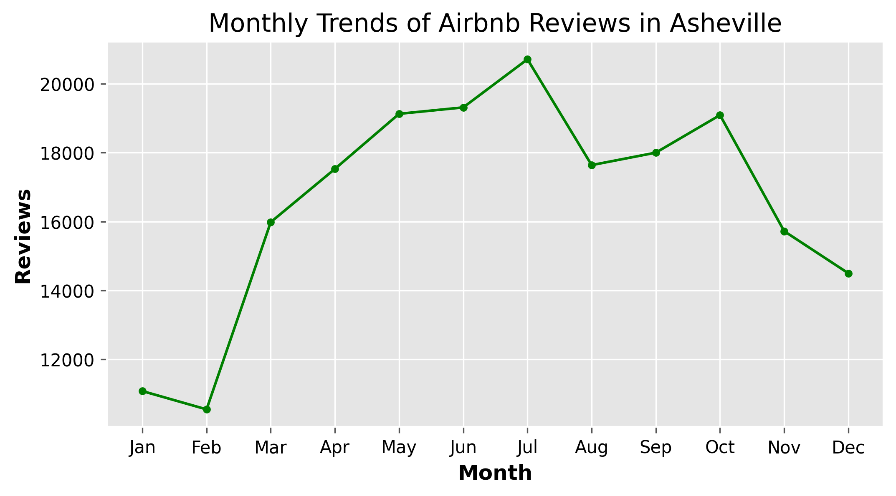
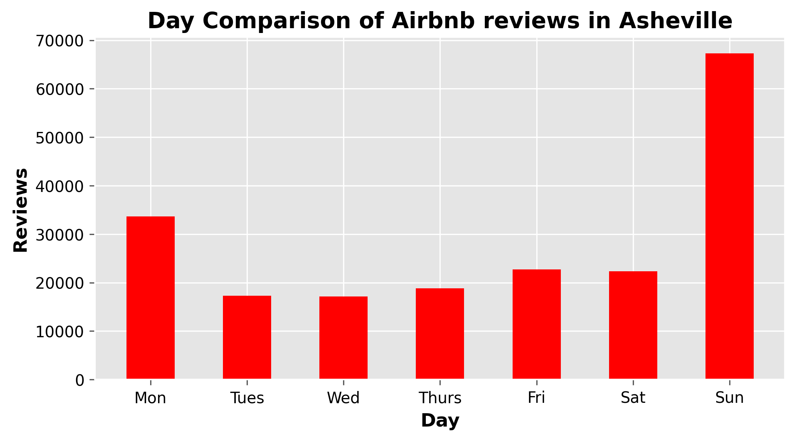

# Asheville Airbnb Listings Analysis

## Introduction
This project explores Airbnb listings in Asheville to understand host behavior, pricing trends, property availability, and user review patterns. The analysis combines listing-level details with review history to uncover insights into the Airbnb market dynamics in Asheville.

---

## Objectives
The key objectives of this analysis are:

- To explore the overall distribution and characteristics of Airbnb listings in Asheville.
- To examine pricing trends by comparing price by `neighbourhoods`, `minimum_nights`, and other variables.
- To understand review and demand patterns.
- To derive insights regarding host behavior.
- To give recommendations that can inform hosts, customers, or marketers.

---

## Dataset and Context
Two datasets were used:

1. **Listings Dataset** contains detailed information about each property such as:
   - `id`, `name`, `host_id`, `host_name`, `neighbourhood`, `room_type`, `price`, `minimum_nights`, `availability_365`, `number_of_reviews`, `reviews_per_month`, `last_review`, and others.
   - Each row represents a **unique listing (property)**.

2. **Reviews Dataset** contains:
   - `listing_id`, `date`
   - Each row represents a **review** for a particular listing on a specific date.

Credit to **[Analyst Builder](https://www.analystbuilder.com/projects/asheville-airbnb-listings-analysis-hQNaU)** for the datasets and the directions for the analysis.

---

## Libraries Used
The analysis was performed in **Python**, mainly using:

- `pandas` - for data wrangling and analysis
- `numpy` - for numerical computation
- `matplotlib` and `seaborn` - for visualization

The jupyter notebook is attached for reproducibility.

---

## Data Cleaning
The following data preparation steps were undertaken:

- **Dropped irrelevant columns** and renamed datasets for clarity.
- **Filtered out old listings** with last reviews before 2021.
- **Dropped possible duplicates** (none were found).
- **Merged** the listings and reviews datasets on `listing_id`.
- **Handled missing values** by imputing the `price` column with the **median**, specifically to address skewed distributions from outliers.
- **Identified and handled outliers** using percentile-based capping (Winsorization) for variables like `price` and `minimum nights`.
- **Converted dates** to datetime format for proper filtering and trend analysis.
- **Filtered** reviews between 2021 and 2025 to focus on current trends.

---

## Key Findings
- The **price distribution** is highly right-skewed (skew = 3.3, kurtosis = 14), indicating a few extremely high-priced listings which may result from luxurious/premium listings. The average price was $169 with a median of $128.00.

- **Entire home/apartment** is the most common room type, having a percentage share of 89%. Private rooms have close to a 10% share of the room types.

- The distribution of the **`calculated_host_listings_count`** shows that most hosts have fewer than 3 listings (median = 2), with a few hosts having more than 10 listings. One host has more than 100 listings!

- The distribution of **`availability_365`** shows a slightly negatively-skewed distribution. The median availability is 254 days with an average of 224 days. This means that most listings are available for booking for the majority of the year. At the extreme left, it shows a good number of listings have a small `availability_365` (< 5).

- **Neighbourhood `28806`** has the cheapest average price amongst the neighbourhoods. It is also very likely that since neighbourhood `28806` is highly competitive (with 800 listings), hosts may be compelled to reduce prices to stay competitive.

- **Neighbourhoods `28806`, `28801`, `28804`, `28803`, and `28805`** are the top 5 neighbourhoods that generate the most guest activity.

- **Market demand** began to rise steadily from 2011 to 2019 and dipped slightly in 2020, likely due to the impact of COVID-19. From 2020, demand has grown every year but saw its all-time high in 2023 before dipping in 2024.

- **Review activity/demand peaks in July** and declines in November, December, and January (the winter period).

 

- **Sunday** leads as the day with the most review activities with **67,274 reviews, representing a little over one-third (33.8%)** of all reviews. It is possible most people are relaxed on Sundays and have time for activities like writing reviews. It could also suggest that most checkouts happen over the weekend.

---

## Conclusion and Insights
- The Asheville Airbnb market looks promising for businesses with the right strategies: a few high-value properties dominate earnings while most operate at moderate prices.

- Review activity is consistent with seasonal tourism trends. Weekends and Sundays show spikes, with dips occurring during the winter.

- The property type with strong opportunities is **`Entire home/Apt`**, which has a market share of over 89%. **Neighbourhoods `28806`, `28801` and `28803`** should be considered by businesses and individuals since they are the market hotspots in Asheville.

- Demand is active on all days of the month. Sunday is the most active review day, taking over 1/3 of the reviews. It also suggests that most checkouts occur during the weekends and that bookings may be high from Wednesday towards Saturday. Marketing campaigns can be intensified from midweek towards the weekend.

---

## Opportunity for Further Analysis
Future analysis could explore:

- **Price prediction modeling** using features like room type, location, and host characteristics.
- **Host-level performance** (e.g., identifying superhosts, host response rates, or occupancy estimation).
- **Sentiment analysis** on review text (if available).
- **Geospatial analysis** - mapping listings by neighborhood to study location-based price dynamics.